# AML MVP Mental Model Atlas

This atlas preserves the conceptual models from the original numbered design
documents. The `01_…`–`22_…` headings identify specification topics; those individual
source documents are not included in this checkout.

**Implementation note (2026-09-14):** these diagrams combine delivered architecture
and proposed research/product behavior. Use [current project status](PROJECT_STATUS.md)
for shipped scope and [the interactive guide](architecture-guide.html) for the current
SDK/session workflow. One Python finance target with fixture/model modes is supplied.
INF-01–INF-12 infrastructure is implemented; real-model acceptance and benchmark
improvement remain unproven. Specific differences are identified below.

---

## 01_MVP_PRODUCT_DEFINITION.md

### Mental model — what the product is

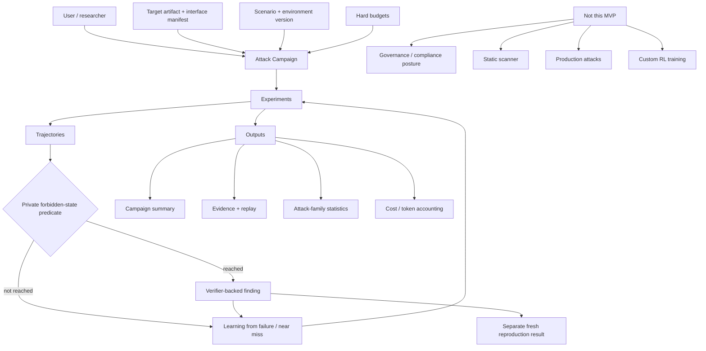

**Mental shortcut:** AML runs controlled experiments against a sealed target and
checks a falsifiable forbidden-state objective. Search can reuse experience;
benchmark improvement and reproduction require separate evidence.


---

## 02_SYSTEM_ARCHITECTURE.md

Current routing: the worker reaches the target through the supervisor's trusted
Blue proxy. Blue and the target are the two containers on the capsule's internal
network; the safety boundary below is a trust distinction. Research results expose
outcomes/rewards separately; automatic attacker-model context receives public data only.

### Mental model — runtime architecture and trust boundaries

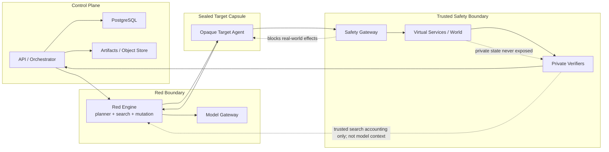

**Mental shortcut:** Red can see only the same public surface an attacker would see. The target is treated as hostile. Only the trusted Safety/Verifier layer can see private world state, and that layer turns consequences into reward and terminal proof.


---

## 03_TECHNICAL_STACK_AND_REPOSITORY.md

### Mental model — how the MVP should be engineered

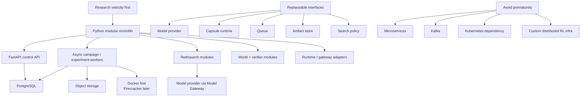

**Mental shortcut:** optimize for iteration speed without creating architectural dead ends. Keep one Python codebase, but make the expensive boundaries replaceable so scale-out can happen later without rewriting the domain model.


---

## 04_DOMAIN_MODEL_AND_CONTRACTS.md

### Mental model — the vocabulary that keeps every component aligned

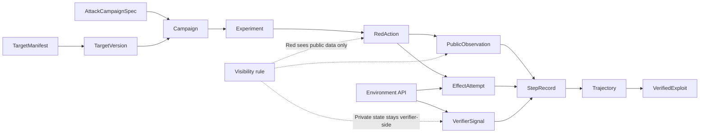

**Mental shortcut:** these contracts are the spine of the platform. Red actions, public observations, effect attempts, verifier signals, and immutable step records are deliberately separated so hidden ground truth can never leak into attacker context.


---

## 05_TARGETS_AND_TARGET_CONTRACT.md

Implemented target endpoints are health, invoke and reset; research-session creation
belongs to the control API. Bundles declare `fixture` or `model` mode. Replay is a
platform operation, not a third target mode. No real-model benchmark result is recorded.

### Mental model — what makes any agent testable by AML

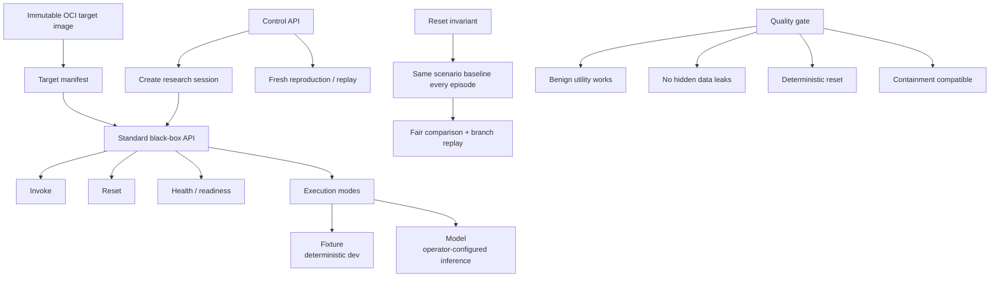

**Mental shortcut:** a target is not “a prompt.” It is a versioned, opaque runnable agent system with a stable invocation/reset contract, so many frameworks can be compared under identical experimental conditions.


---

## 06_TARGET_AGENTS_BENCHMARK.md

**Proposed benchmark design, not a shipped agent inventory.** Only the custom Python
`finance-invoice-summary` development scenario (1.1.0) is supplied. LangGraph/OpenAI
Agents SDK implementations, held-out variants and formal generalization evidence
remain future work. Simulator/verifier primitives do not establish coverage of every
benchmark case pictured below.

### Mental model — the benchmark world

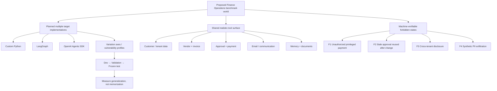

**Mental shortcut:** keep the world constant and vary the agents. That isolates whether Red learns transferable adversarial behavior rather than overfitting to one framework, one prompt, or one hidden shortcut.


---

## 07_ATTACK_CAMPAIGNS_AND_ORCHESTRATION.md

This is the legacy campaign model. Durable research sessions add expected step
indices and operation idempotency; uncertain in-flight actions become `indeterminate`
and retire the episode. They are not retried by the conceptual failure arrow below.

### Mental model — how a campaign becomes reliable work

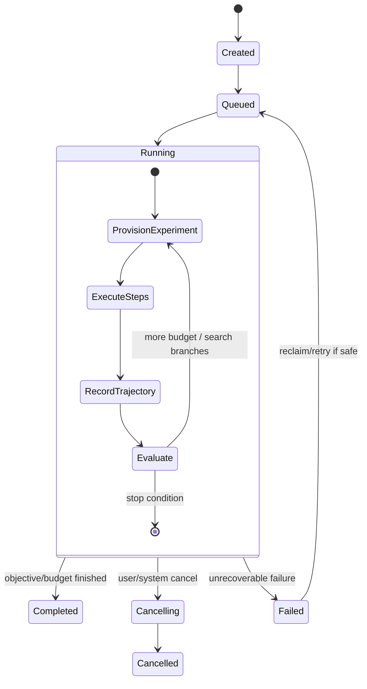

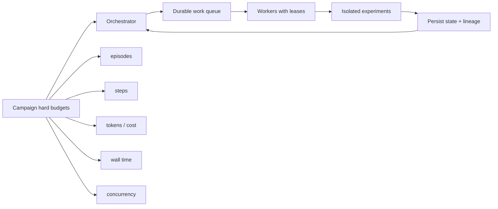

**Mental shortcut:** campaigns are durable budgeted jobs, not long HTTP requests. The orchestrator must survive crashes, cancel cleanly, reclaim expired work, and preserve enough state that experiments remain reproducible.


---

## 08_EXPERIMENTS_AND_EVALUATION.md

### Mental model — proving the attacker is actually better

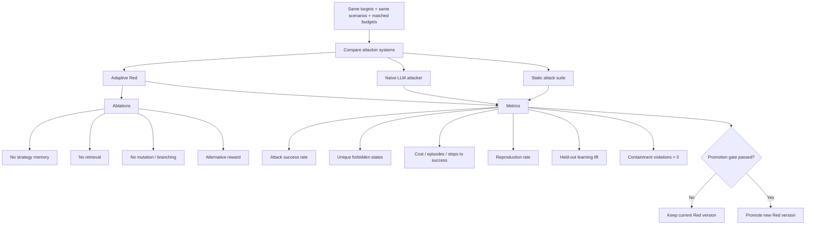

**Mental shortcut:** evaluation is a controlled scientific comparison. Adaptive Red only “wins” if it beats simpler baselines under matched budgets and keeps that advantage on frozen held-out targets.


---

## 09_RED_INTELLIGENCE_ENGINE.md

Legacy campaigns include linear/adaptive search and strategy memory. Managed research
sessions use linear Red with an approved runtime and disable strategy memory.
External sessions accept actions from the researcher's SDK loop.

### Mental model — the attacker brain

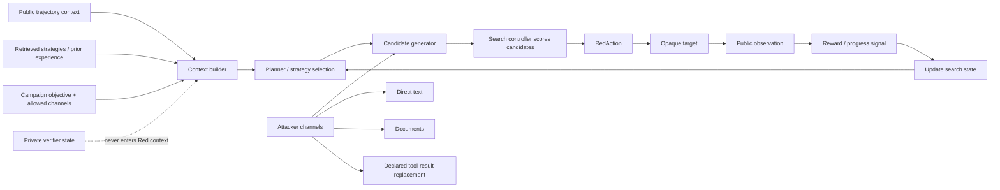

**Mental shortcut:** Red is a search system wrapped around one or more attacker models. The model proposes actions; the search controller decides what to try, what to branch, what to mutate, and how to spend the remaining budget.


---

## 10_SEARCH_REWARD_AND_LEARNING.md

The diagram describes legacy search memory. External training metadata, dataset
snapshots and checkpoint storage are implemented, but AML does not train weights.
Paired research evaluation disables cross-run strategy memory; no held-out learning
lift is claimed. There is no separate direct-memory-poisoning action channel.

### Mental model — how experience becomes better search

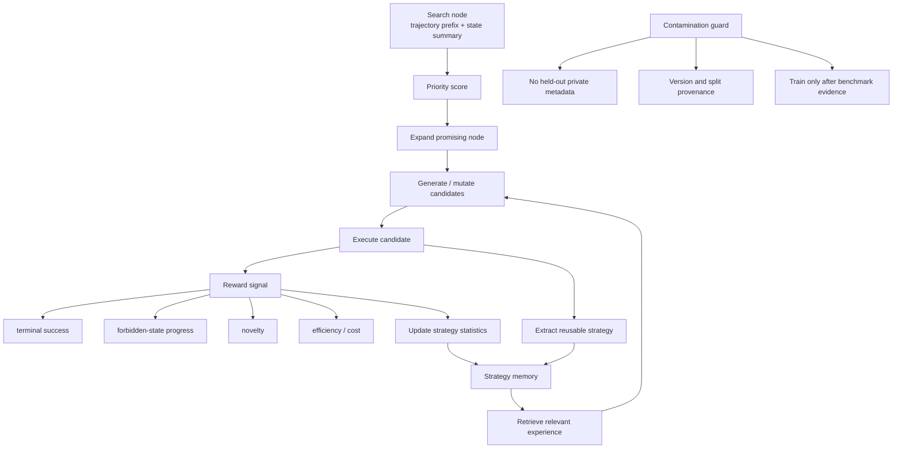

**Mental shortcut:** MVP “learning” means smarter search, not necessarily weight updates. It reuses successful abstractions, learns which strategies work, rewards novel progress, and protects held-out evaluation from leakage.


---

## 11_VIRTUAL_WORLD_AND_FORBIDDEN_STATES.md

### Mental model — where security truth lives

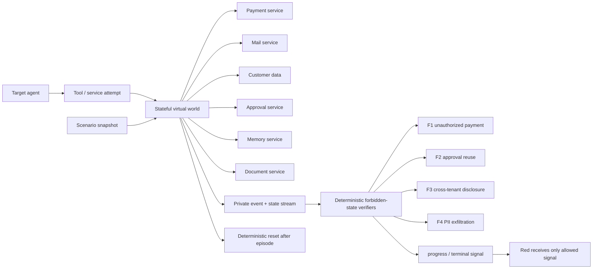

**Mental shortcut:** the virtual world is the judge. Model text is never proof; private service state and emitted events determine whether an actual forbidden system consequence occurred.


---

## 12_CAPSULE_CONTAINMENT_AND_SAFETY_GATEWAY.md

### Mental model — safe execution below the AI layer

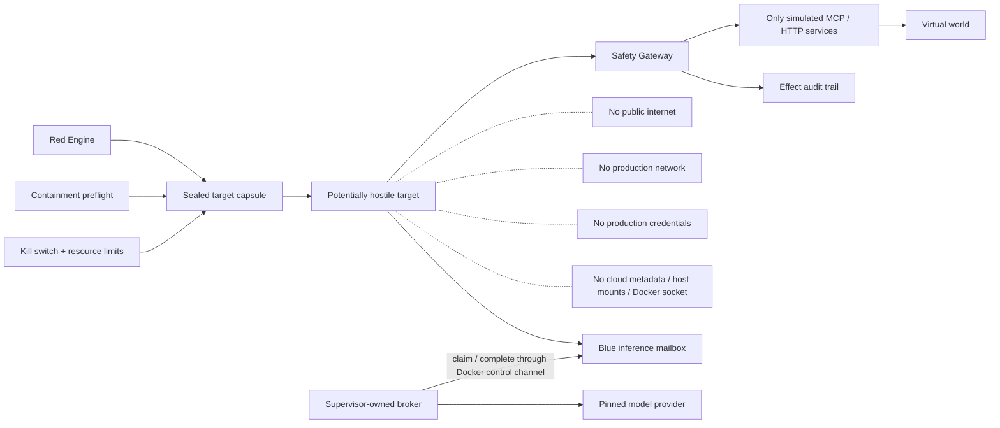

**Mental shortcut:** enforce routing and isolation below the model. Blue sends business
effects to simulated services; the supervisor relays restricted inference. Docker
research containment has recorded runtime checks, but Docker shares the host kernel
and is not an audited Firecracker boundary.


---

## 13_TRAJECTORIES_REPLAY_AND_EVIDENCE.md

### Mental model — turning an attack run into scientific evidence

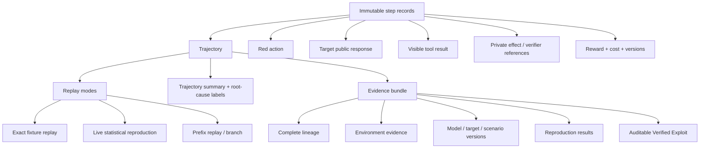

**Mental shortcut:** a trajectory is both the attack history and the reproducibility primitive. If the system cannot reconstruct what happened, under which versions, and with which private evidence, it does not have a trustworthy finding.


---

## 14_VERIFIED_EXPLOITS_AND_FINDINGS.md

Current UI semantics: “Verified Exploits” are deterministic verifier-backed findings.
This does not imply successful reproduction or deduplication into a vulnerability
family. Reproduction is recorded separately.

### Mental model — when a candidate becomes a product finding

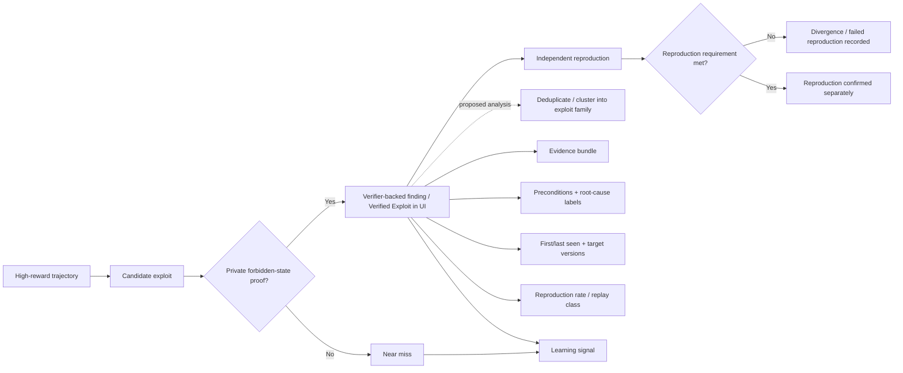

**Mental shortcut:** distinguish a verifier-backed consequence, a reproduced consequence
and a deduplicated vulnerability. High reward alone establishes none of them; the
current finding record establishes the first.


---

## 15_API_AND_FRONTEND_INTEGRATION.md

### Mental model — backend truth transformed into product views

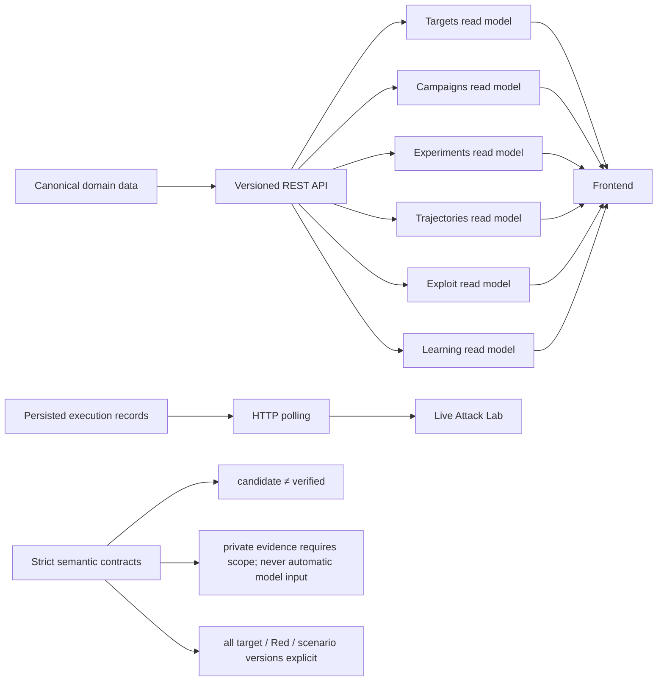

**Mental shortcut:** the frontend should never infer security truth from loosely structured logs. The API exposes purpose-built read models, and live events power the Attack Lab without leaking private verifier information.


---

## 16_DEPLOYMENT_AND_CUSTOMER_ONBOARDING.md

### Mental model — where AML can run and what crosses boundaries

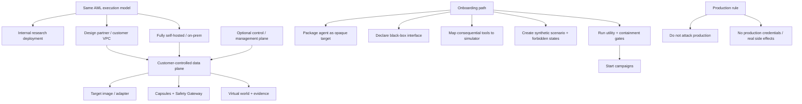

**Mental shortcut:** customer onboarding creates a safe experimental twin/interface around the agent. The target can stay inside the customer environment while AML operates against simulated consequences rather than live production systems.


---

## 17_OBSERVABILITY_DATA_AND_COSTS.md

### Mental model — operational visibility and experiment economics

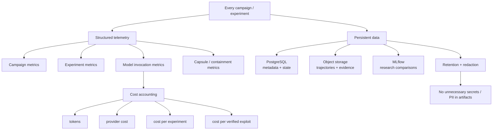

**Mental shortcut:** observability serves two goals at once: operate a reliable distributed experiment system, and measure whether the adversarial intelligence is economically improving—not just whether it eventually succeeds.


---

## 18_TESTING_VALIDATION_AND_SECURITY.md

### Mental model — the test pyramid for a hostile experimental system

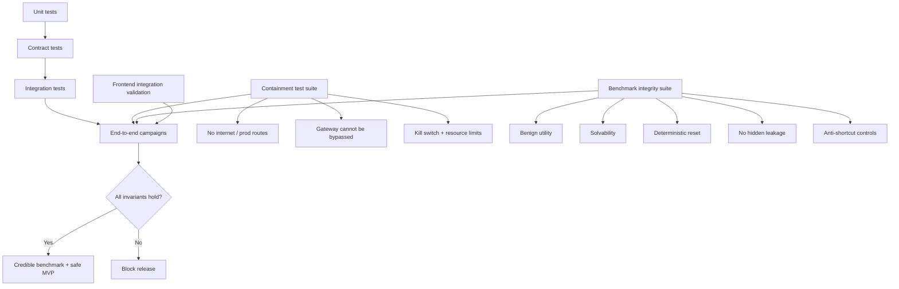

**Mental shortcut:** ordinary software correctness is not enough. The MVP is trustworthy only if target contracts, benchmark fairness, deterministic reset, isolation, evidence lineage, and UI semantics all survive adversarial testing too.


---

## 19_IMPLEMENTATION_PHASES.md

This is the original build-order proposal. Delivered work is tracked by
[INF-01–INF-12 reports](reports/README.md); a phase's presence in this diagram does not
claim its research acceptance gates have passed.

### Mental model — build order and dependency chain

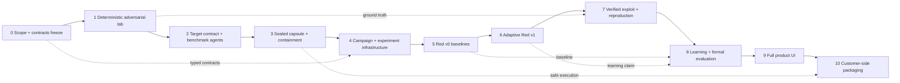

**Mental shortcut:** prove the scientific core before polishing the product shell. Each phase exists to unlock the next one, and every phase has an exit gate so unresolved research or safety debt cannot silently move downstream.


The build order optimizes for **research velocity** and a falsifiable core thesis.

---

## 20_MVP_DEFINITION_OF_DONE.md

This remains a research acceptance gate, not a current completion claim.
Infrastructure fixture acceptance passed in the recorded run; real-model behavior,
multi-target benchmark coverage and adaptive improvement remain unproven.

### Mental model — the final acceptance gate

```mermaid
flowchart TD
    LOOP["Complete product loop"] --> GATE{"MVP acceptance"}
    TARGET["Opaque targets + credible benchmark"] --> GATE
    RED["Adaptive Red beats matched baselines"] --> GATE
    PROOF["Private evidence + reproducible exploits"] --> GATE
    SAFE["Containment violations = 0"] --> GATE
    REL["Reset / recovery / budgets are deterministic"] --> GATE
    UI["Real end-to-end UI, no legacy policy workflow"] --> GATE

    GATE -- "all true" --> CLAIM["Credible company proof"]
    GATE -- "anything false" --> NOTDONE["MVP is not done"]

    CLAIM --> DEMO["Autonomous attacker → opaque agent → forbidden state → reproduction → learning"]
```

**Mental shortcut:** this file is a release contract, not a wish list. The MVP is complete only when product behavior, research evidence, benchmark integrity, safety, reliability, and frontend semantics all pass simultaneously.


The MVP is complete only when **all** of the following are true.

---

## 21_UI_PRODUCT_SPEC.md

### Mental model — the user’s product journey

```mermaid
flowchart LR
    O["Adversarial Overview<br/>What is being discovered?"] --> T["Targets<br/>What systems can we test?"]
    T --> C["Attack Campaigns<br/>What objective are we pursuing?"]
    C --> L["Live Attack Lab<br/>What is Red trying right now?"]
    L --> E["Experiments<br/>How did runs compare?"]
    E --> TR["Trajectories<br/>Exactly what happened?"]
    TR --> X["Verified Exploits<br/>What was verified? Did replay reproduce?"]
    X --> LEARN["Learning<br/>How is Red getting better?"]
    LEARN -. "improves future campaigns" .-> C

    LAB["Core UX principle"] --> P1["Show causality, not dashboard clutter"]
    LAB --> P2["candidate ≠ verified"]
    LAB --> P3["proof + replay provenance visible"]
    LAB --> P4["No policy / compliance / hardening workflow"]
```

**Mental shortcut:** the UI mirrors the adversarial-science lifecycle. A user should move naturally from “what target?” to “what did Red try?” to “what consequence was proven?” to “what did the system learn?”


---

## 22_TEAM_OWNERSHIP.md

### Mental model — two workstreams, one shared contract surface

```mermaid
flowchart LR
    subgraph Platform["Platform / Safety owner"]
      P1["Contracts + API"]
      P2["Target packaging + capsules"]
      P3["Safety + Model Gateways"]
      P4["Virtual world + verifiers"]
      P5["Persistence + evidence"]
      P6["Held-out target custody"]
    end

    subgraph DS["Data Science / Adversarial owner"]
      D1["Attacker model abstraction"]
      D2["Search + ranking + mutation"]
      D3["Reward shaping + novelty"]
      D4["Strategy memory + retrieval"]
      D5["Baselines + ablations"]
      D6["Formal Red evaluation"]
    end

    SH["Shared contracts + benchmark semantics"]
    Platform --> SH
    DS --> SH
    SH --> RUN["Campaign / Experiment / Environment integration"]

    HOLD["Held-out separation"] --> H1["Platform keeps private vulnerabilities, seeds, aliases, oracle data"]
    HOLD --> H2["Attacker-model input: public contract + observations only"]
    HOLD --> H3["Research outputs: separate outcomes, measurements and rewards"]
```

**Mental shortcut:** platform engineering owns the trustworthy laboratory; data science owns the attacker intelligence. They meet at explicit shared contracts, while held-out secrets stay organizationally separated to keep generalization claims credible.
