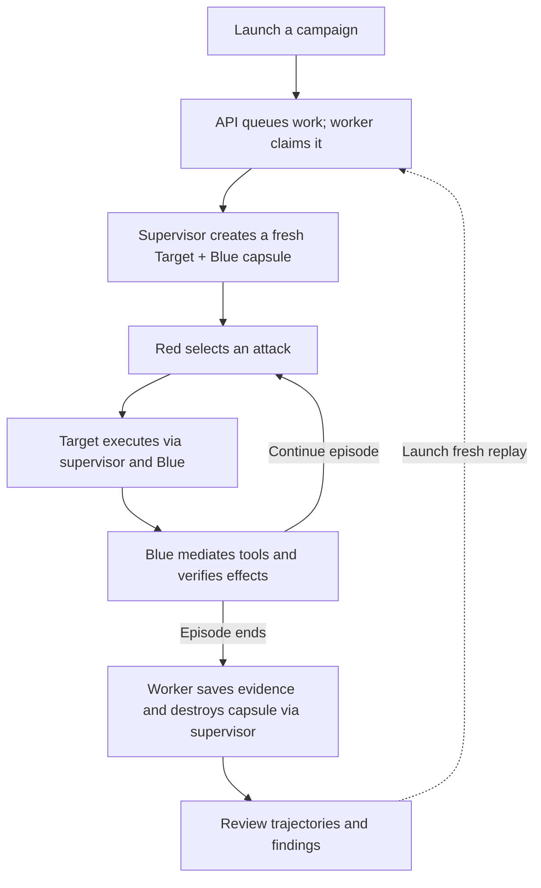

# AML — Adversarial Agent Research Platform

[Run locally](#run-locally) · [Architecture design](#architecture-design)

## Run locally

Requires Docker running with Compose v2, Python 3.12+, `uv`, `make`, and Node
22.13+ with npm. From the repository root, run:

```bash
# Install dependencies and create backend/.env if it does not exist.
make setup
cd backend

# Give the supervisor access to the Docker socket on Linux.
if [ "$(uname -s)" = "Linux" ]; then
  export DOCKER_GID="$(stat -c '%g' /var/run/docker.sock)"
fi

# Build and start all services, including database migrations.
docker compose up -d --build --wait

# Build and register the finance reference target.
uv run adversarial-bundle build-reference --output var/bundles/finance-reference.json
# Stream into writable /tmp; docker compose cp fails with the read-only rootfs.
docker compose exec -T api sh -c 'cat > /tmp/reference.json' < var/bundles/finance-reference.json
docker compose exec -T api python -m adversarial_agent_mvp.bundle_cli register /tmp/reference.json
```

Open **[localhost:3000](http://localhost:3000)**, select the registered target,
and create an attack campaign. Inspect its experiments, trajectories, and verified
findings in the console. The UI and API run as one shared Admin, with full access
and no login or user access token. API clients can call the backend directly
without an authorization header. The default target uses a scripted fixture and
needs no model credentials. Configure ports in `backend/.env`.

API docs are at [localhost:8000/docs](http://localhost:8000/docs), MLflow at
[localhost:5000](http://localhost:5000), and MinIO at
[localhost:9001](http://localhost:9001).

From `backend/`, use `docker compose logs -f api worker capsule-supervisor` to
follow logs and `docker compose down` to stop services while keeping stored data.

## Architecture design

The POC runs as one Admin. Each campaign executes isolated episodes in which
**Red** selects attacks, the **target** acts, and **Blue** mediates tools and
verifies simulated business effects.

### Campaign lifecycle



The execution path is **worker → supervisor → Blue → target**. Target tool calls
return to Blue; the worker records observations and verified outcomes. An episode
ends on success, target termination, a limit, or failure. A campaign can run more
episodes within its budget, each in a fresh capsule. Replay queues a new campaign;
a recorded finding alone does not confirm successful reproduction.

<a id="current-implementation"></a>

The bundled runtime uses Docker and ships one finance reference target with
scripted `fixture` and configurable `model` modes. The UI and API share full Admin
access without login. See the [architecture guide](architecture-guide.html) for
execution boundaries and evidence semantics.
