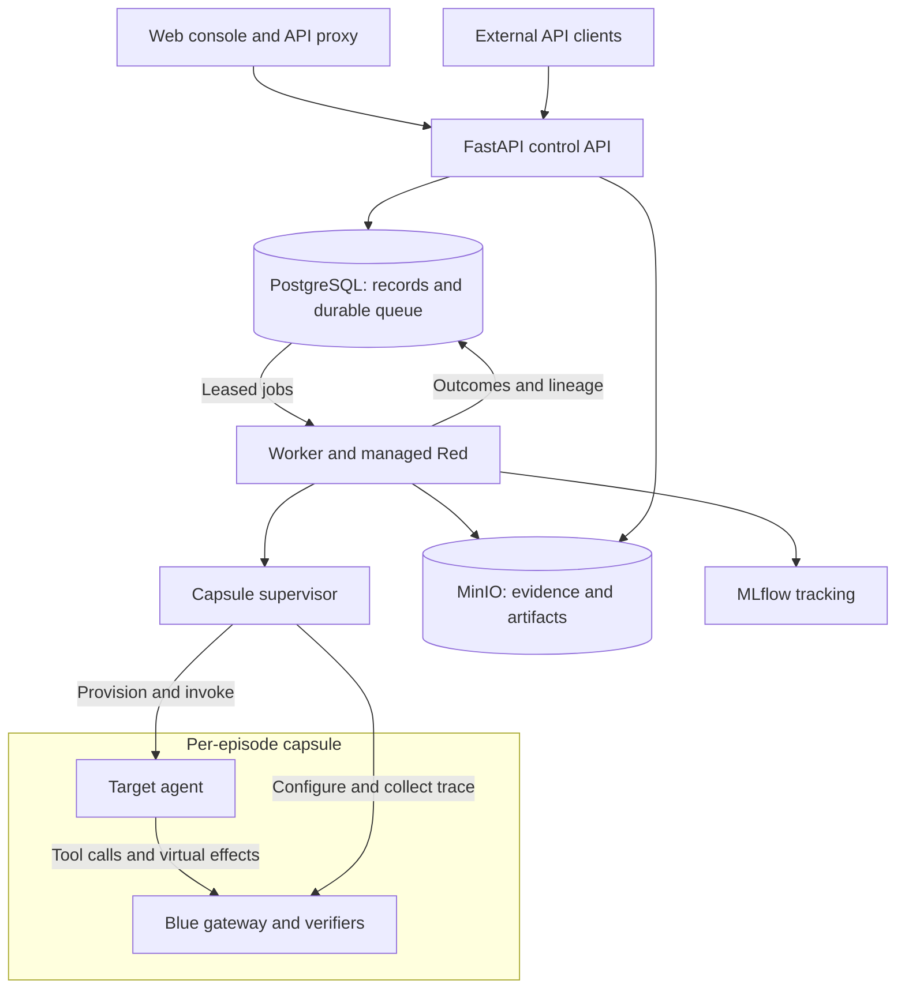

# AML — Adversarial Agent Research Platform

[Run locally](#run-locally) · [Architecture design](#architecture-design)

## Run locally

Requires Docker running with Compose v2, Python 3.12+, `uv`, `make`, and Node
22.13+ with npm. From the repository root, run:

```bash
# Install dependencies and create backend/.env if it does not exist.
make setup
cd backend

# Give the supervisor access to the Docker socket on Linux.
if [ "$(uname -s)" = "Linux" ]; then
  export DOCKER_GID="$(stat -c '%g' /var/run/docker.sock)"
fi

# Build and start all services, including database migrations.
docker compose up -d --build --wait

# Build and register the finance reference target.
uv run adversarial-bundle build-reference --output var/bundles/finance-reference.json
docker compose cp var/bundles/finance-reference.json api:/tmp/reference.json
docker compose exec -T api python -m adversarial_agent_mvp.bundle_cli register /tmp/reference.json
```

Open **[localhost:3000](http://localhost:3000)**, select the registered target,
and create an attack campaign. Inspect its experiments, trajectories, and verified
findings in the console. The UI and API run as one shared Admin, with full access
and no login or user access token. API clients can call the backend directly
without an authorization header. The default target uses a scripted fixture and
needs no model credentials. Configure ports in `backend/.env`.

API docs are at [localhost:8000/docs](http://localhost:8000/docs), MLflow at
[localhost:5000](http://localhost:5000), and MinIO at
[localhost:9001](http://localhost:9001).

From `backend/`, use `docker compose logs -f api worker capsule-supervisor` to
follow logs and `docker compose down` to stop services while keeping stored data.

## Architecture design

AML runs controlled attacks against isolated target agents. **Red** chooses attack
actions, **Blue** mediates simulated business effects, and trusted verifiers
record outcomes.



### Components and responsibilities

| Component | Responsibility |
| --- | --- |
| Web console | Register targets, launch campaigns, and inspect experiments, trajectories, findings, evidence, and strategy memory. |
| Control API | Validate requests and limits; persist commands and expose research records. |
| Worker and Red | Lease queued work, select attacks, execute episodes, and persist results. |
| Capsule supervisor | Manage capsule lifecycle, own Docker access, and broker target model inference. |
| Target and Blue | Run in separate containers on an internal network. Blue enforces policy and records trusted events for simulated business effects. |
| Persistence | PostgreSQL stores commands, outcomes, and lineage; MinIO stores artifacts; MLflow tracks runs. |
| Supporting services | The target registry preserves images; OpenTelemetry collects service telemetry. |

### Episode lifecycle and isolation

1. Bind a pinned target image to a scenario, policy, seed, and resource limits.
2. Provision a fresh capsule and check readiness.
3. Red submits interventions; the target acts through Blue's controlled tools.
4. Verify trusted events and save observations, outcomes, usage, and evidence.
5. Finalize the trajectory and destroy the capsule. Replay uses a fresh execution.

Target model requests follow **target → Blue mailbox → supervisor broker → model
provider**. Provider credentials and connectivity stay outside the capsule.
Internal service tokens and target capability checks still protect communication
with the supervisor and Blue gateway. Request validation and resource limits
apply to the shared Admin; conventional user login is deferred beyond the POC.
The target cannot certify its own success; a recorded finding and a successful
fresh replay are separate results.

<a id="current-implementation"></a>

The included target is one finance reference agent with scripted `fixture` and
configurable `model` modes. Docker capsules share the host kernel and serve as
the development isolation runtime. A production Firecracker/KVM runner is not
bundled or validated. Training runs externally; fixture outcomes do not establish
real-model performance.

For the detailed design, see the [architecture guide](architecture-guide.html).
