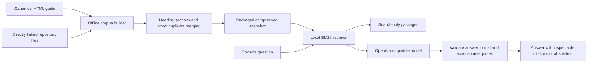

# Ask AML: documentation retrieval and chatbot

Ask AML lives in the existing console at `#/guide`. It answers questions about the
architecture, components and research lifecycles from the canonical
[HTML guide](../../architecture-guide.html) and its directly linked repository files.
Use an **operator** token in the console connection dialog.

## Enable answers

The default provider is `https://api.openai.com/v1`, model `gpt-4.1-mini`.
Add `GUIDE_MODEL_API_KEY` to the backend's private local environment file and restart
the API. No model credential is included in this repository or sent to the browser.
Without a key, Ask AML provides searchable source passages and clearly labels that
mode. A configured key means configuration is present, not that provider access has
been verified. Provider errors are reported when a question is submitted.

For local Python development, settings load `backend/.env` when launched from
`backend/`. For the complete Compose stack, the same file supplies API settings;
rebuild changed API/UI images with `docker compose up -d --build api ui`.
For the authenticated research demo, put the guide settings in the existing
`backend/var/research-smoke.env`, rebuild `adversarial-api:local` and
`adversarial-ui:local` using the root README, then recreate its API/UI services:

```bash
# From backend/, after rebuilding those two images:
docker compose --env-file var/research-smoke.env -f compose.research-smoke.yaml up -d api ui
```

Open **Ask AML** in the navigation. Ask a suggested question, inspect numbered source
references, or choose **Search only**. Clear the conversation to start again.
Conversations are held in the current component's memory and clear when leaving this
view, changing connections or reloading. Generation sends the question, recent chat
history and retrieved passages to the configured provider. Search-only requests stay
on the AML backend. Provider retention follows the operator's provider settings.

| Backend setting | Default / purpose |
|---|---|
| `GUIDE_MODEL_BASE_URL` | `https://api.openai.com/v1`; an OpenAI-compatible Chat Completions base URL |
| `GUIDE_MODEL_NAME` | `gpt-4.1-mini` |
| `GUIDE_MODEL_API_KEY` | Required for generation; separate from target/attacker credentials |
| `GUIDE_MODEL_MAX_OUTPUT_TOKENS` | `1800`, configurable from 256 to 4096 |
| `GUIDE_MODEL_TOKEN_PARAMETER` | `max_tokens`; use `max_completion_tokens` for providers requiring it |
| `GUIDE_MODEL_JSON_MODE` | `true`; disable only for providers without JSON mode |
| `GUIDE_MODEL_TIMEOUT_SECONDS` | `45` |
| `GUIDE_MODEL_MAX_CONCURRENCY` | `2` per API process; excess requests receive 429 |
| `GUIDE_REQUESTS_PER_MINUTE` | `20` generated-answer attempts per owner per API process |
| `GUIDE_CORPUS_PATH` | Optional alternate prebuilt snapshot; default is packaged with backend |

Set provider spending limits separately. Process-local request limits are not an
account-wide monetary budget. Stopping a browser request may not stop provider billing.

## Data flow and lifecycle



1. **Ingest:** the operator CLI reads `architecture-guide.html` and direct local
   links only. It excludes scripts, styles, navigation and repeated interactive
   summaries. It does not recursively crawl linked documents, fetch websites or read
   arbitrary paths supplied by chat users. Repository escapes, hidden files,
   unsupported extensions and oversized linked files fail the build.
2. **Normalize and merge:** heading-aware chunks have no stored overlap. Identical
   normalized chunk text is stored once, retaining every source reference. The old
   `project-guide.html` is a redirect and is never indexed as a second guide.
   Different documents can discuss the same subject; this is not a claim that all
   paraphrases have been removed. Retrieval also suppresses highly similar results.
3. **Package:** a deterministic gzip JSON snapshot contains content hashes, source
   paths, section headings, anchors and chunk IDs. It ships in the Python wheel and
   API image; runtime access to the repository is unnecessary.
4. **Retrieve:** local BM25 lexical ranking selects at most six passages, with a
   maximum of two per document. It favors explanatory/current documents and applies
   a small vocabulary alias map. This is retrieval-augmented generation without an
   embedding service or vector database. Very indirect wording can miss relevant
   material; use component names or API symbols when necessary.
5. **Generate:** the model receives only selected passages and up to six recent
   conversation messages. It has no execution tools and cannot inspect live AML
   experiments. The prompt treats document instructions and chat history as
   untrusted input and distinguishes current status from historical reports.
6. **Verify:** each answer paragraph must include a numbered source and an exact
   supporting quote. The server checks quote membership, output structure, completion
   status and response size. Invalid answers fail closed. These checks prove quote
   provenance, not that every paraphrase logically follows from its quote. Users
   should inspect evidence for consequential conclusions.
7. **Abstain:** no matching passages or a model-declared evidence gap produces an
   explicit insufficient-evidence response. No-match requests do not call the model.

## Refresh the knowledge

Edit the original guide/documents, then rebuild and check the derived snapshot:

```bash
# From backend/:
uv run python -m adversarial_agent_mvp.guide_corpus --repo ..
uv run python -m adversarial_agent_mvp.guide_corpus --repo .. --check
```

The CLI prints document/chunk counts and exact duplicates merged. `--check` fails
when source content or the direct-link set has changed. Commit the source edits and
rebuilt snapshot together. Rebuild the API image and restart the API to load it;
each process lazily loads its snapshot once. In local Python development a restart
is sufficient. The Sources panel exposes the loaded corpus checksum and manifest.
Do not edit `guide_knowledge.json.gz` manually. Historical reports retain their dates
and provenance rather than being silently overwritten with current claims.

## API and access boundary

| Endpoint | Behavior |
|---|---|
| `GET /v1/guide/status` | Configuration readiness, model, corpus digest and manifest |
| `POST /v1/guide/search` | `{ "question": "..." }` → selected passages and digest |
| `POST /v1/guide/chat` | Question plus optional user/assistant history → cited answer |

All three use the existing bearer authentication, `aml.research.v1` version contract,
request bounds and **operator** scope. Linked source files include private scenario
and verifier details, so the corpus is not exposed through research-only tokens or
attacker observations. Existing local development mode permits its implicit local
operator; production deployments must configure authentication as described in the
research integration guide. No HTTP endpoint accepts filesystem paths or corpus URLs.

The UI uses the existing same-origin API proxy. Deploying it remotely also requires
an authenticated, reachable AML backend; the UI deployment alone cannot host the
Python service. Keep `GUIDE_MODEL_API_KEY` on that backend, not in Sites or client code.

## Validation

`tests/test_guide_rag.py` covers HTML filtering, path confinement, deterministic
snapshot encoding, exact duplicate alias merging, representative project retrieval,
operator authorization, missing-key search mode, provider request shape, exact quote
validation, abstention, bounded requests, rate/concurrency limits and sanitized errors.
Provider calls use an HTTP fixture. A successful fixture run does not establish
real-provider answer quality; run representative CTO, architecture and research
questions after supplying the actual credential.
